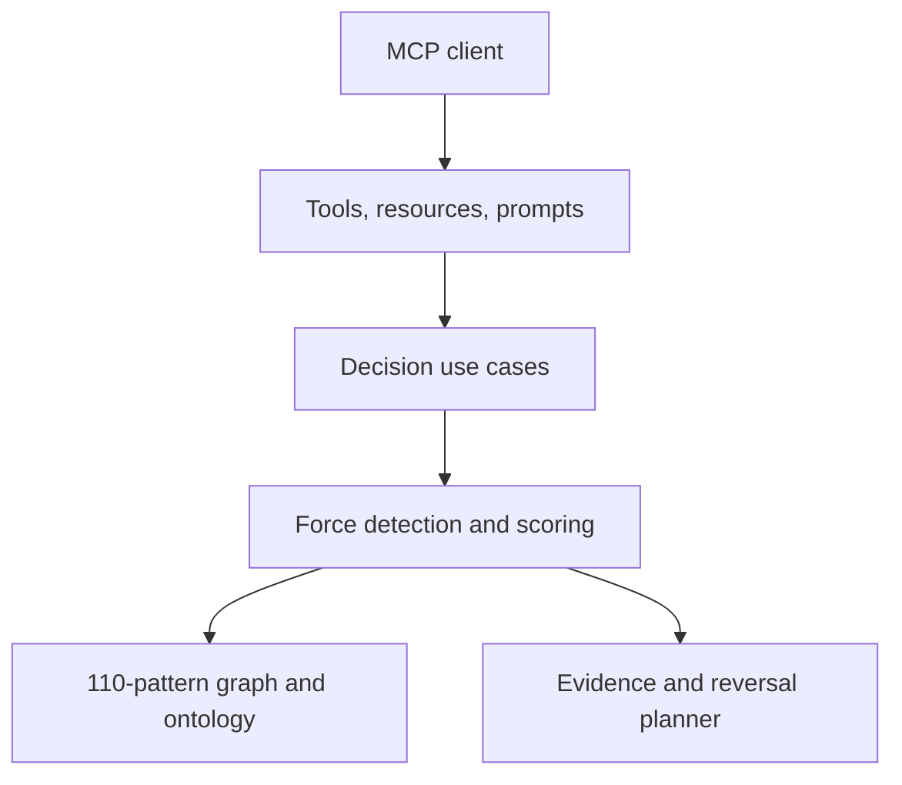

# Pattern Intelligence MCP

Evidence-aware design-pattern decision support for AI coding agents.

Most pattern tools are searchable glossaries. This server is a decision system: it identifies forces,
asks what is missing, scores options transparently, penalizes unjustified complexity, recommends a
direct solution when appropriate, and tells the agent how to prove or reverse the decision.

It is implemented in strict TypeScript and speaks the 2026-07-28 Model Context Protocol through the
official v2 SDK.

## What makes it intelligent

- **Problem-first:** starts from a concrete case rather than a pattern name.
- **No-pattern baseline:** adding an abstraction must beat a direct solution.
- **Transparent scoring:** lexical, force, structured-context, cost, and contradiction terms are exposed.
- **Layer-aware:** language idioms, GoF patterns, domain patterns, messaging, distributed systems,
  concurrency, testing, and architectures are not treated as interchangeable.
- **Counterfactual:** scenario mutations reveal when the recommendation changes.
- **Anti-cargo-cult:** expensive patterns are penalized when scale, team, or evidence does not support them.
- **Evidence-gated:** every candidate carries measurements, experiments, rejection criteria, and deletion triggers.
- **Deterministic:** no model API, embeddings service, database, or hidden session is required.

## MCP surface

| Tool | Use it when | Distinguishing output |
|---|---|---|
| `analyze_design_case` | The solution space is open | Forces, questions, scores, rejections, direct baseline, compound |
| `compare_pattern_options` | Two to six options are genuinely plausible | Contextual winner or no winner, plus tipping points |
| `detect_pattern_misuse` | A pattern is proposed or already present | Cargo-cult risk, contradictions, simpler alternatives |
| `stress_test_pattern_decision` | Scale, consistency, delivery, or team assumptions may change | Decision flips and sensitivity |
| `plan_pattern_adoption` | One candidate deserves a trial | Reversible stages, exit criteria, rollback |
| `write_pattern_adr` | The reasoning must survive the conversation | Proposed ADR with uncertainty and reversal triggers |
| `get_pattern_evidence_plan` | A recommendation needs proof | Hypothesis, measures, experiment, rejection and removal criteria |
| `query_pattern_graph` | Discovery should stay bounded to a force or seed | Contextual nodes and relationships with layer/cost filters |

Resources expose the full catalog (`pattern://catalog`), decision ontology
(`pattern://ontology`), individual patterns (`pattern://pattern/{patternId}`), and layers
(`pattern://layer/{layer}`). Prompts provide design-review, architecture-decision, safe-refactor, and
incident-to-pattern workflows.

## The 110-pattern knowledge graph

| Layer | Count | Examples |
|---|---:|---|
| TypeScript-native | 8 | Discriminated Union, Result, Composition Root |
| GoF creational | 5 | Factory Method, Builder, Singleton |
| GoF structural | 7 | Adapter, Bridge, Composite, Decorator |
| GoF behavioral | 11 | Command, State, Strategy, Visitor |
| Enterprise/domain | 17 | Domain Model, Aggregate, CQRS, Event Sourcing |
| Messaging/integration | 18 | Router, Aggregator, Idempotent Receiver, Outbox |
| Distributed/resilience | 18 | Timeout, Circuit Breaker, Saga, Sharding, Cells |
| Concurrency/async | 8 | Mutex, Actor, Reactor, Optimistic Concurrency |
| Testing | 8 | Characterization, Contract, Property-Based, Mutation |
| Architecture | 10 | Ports and Adapters, Modular Monolith, Event-Driven |

Each record contains the problem, realistic system context, mechanism, simpler alternative, misuse,
evidence, TypeScript-specific concerns, adoption cost, operational cost, signals, and graph relations.

## Quick start

Requirements: Node.js 22 or newer.

```bash
npm install
npm run check
npm run build
node dist/cli.js
```

The server uses stdio. Do not write application logs to stdout; protocol-safe diagnostics go to stderr.

Configure an MCP client with an absolute path:

```json
{
  "mcpServers": {
    "pattern-intelligence": {
      "command": "node",
      "args": ["/absolute/path/to/pattern-intelligence-mcp/dist/cli.js"]
    }
  }
}
```

After the package is published, the same shape can use `npx` and the package name. The repository does
not assume publication has already happened.

## A representative decision

Input:

```json
{
  "case": {
    "problem": "Payment provider timeouts and at-least-once delivery cause duplicate charges after retries.",
    "failureModes": ["provider outage", "duplicate delivery"],
    "goals": ["never charge twice", "contain provider latency"],
    "delivery": "at-least-once",
    "evidence": ["0.3% provider timeouts", "17 duplicate attempts last week"]
  }
}
```

The response does not simply say “Retry.” It treats idempotency as a prerequisite, distinguishes
Timeout, Idempotent Receiver, Retry with Backoff and Jitter, and related supporting responsibilities,
asks which operations are safe to repeat, and supplies measurements and rejection criteria.

## Architecture



The MCP adapter contains no decision logic. The core works as a normal TypeScript library, making the
reasoning independently testable. See [Architecture](docs/architecture.md) and
[Scoring model](docs/scoring.md).

## Development

```bash
npm run typecheck
npm run lint
npm test
npm run test:coverage
npm run build
```

The test suite includes catalog integrity, relation validation, misuse cases, comparisons,
counterfactuals, 15 cross-layer decision benchmarks, and end-to-end MCP calls over the official
in-memory transport.

## Important limitations

- Scores are calibrated heuristics, not probabilities or proof of architectural correctness.
- The concept ontology is intentionally explicit and reviewable; novel vocabulary can lower recall.
- Pattern relationships are currently curated as related concepts rather than typed causal edges.
- There is no codebase parser yet. Agents must supply an honest case and evidence.
- The benchmark corpus is a regression suite, not an independent scientific evaluation.

These are product boundaries, not excuses to hide uncertainty. See the [roadmap](docs/roadmap.md) for
the work required before making stronger accuracy claims.

## Principles for contributors

1. Add a force before adding a fashionable pattern.
2. Every recommendation must expose its cost, simpler alternative, and falsification path.
3. Prefer a deterministic rule that can be tested over an opaque score that merely sounds intelligent.
4. Keep protocol code thin and domain code transport-independent.
5. Do not add infrastructure until a measured requirement needs it.

See [CONTRIBUTING.md](CONTRIBUTING.md). Licensed under the [MIT License](LICENSE).
