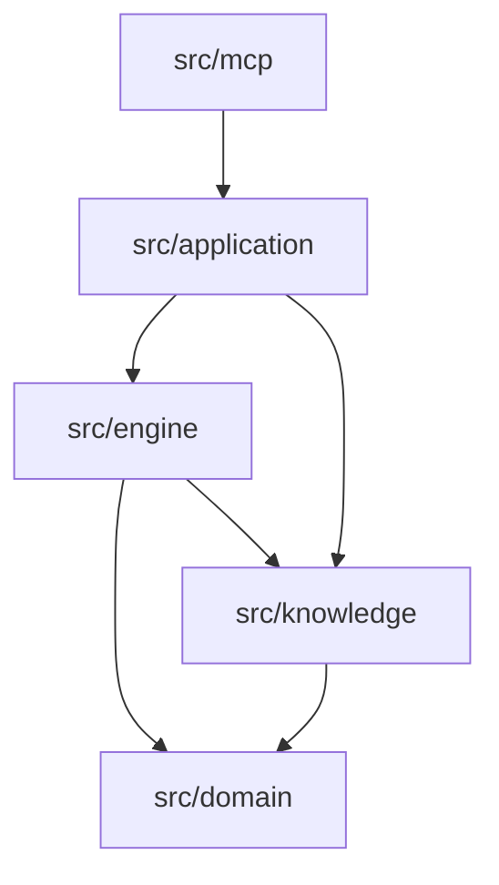

# Architecture

Pattern Intelligence separates decision policy from MCP transport so each can evolve without leaking
responsibilities across the boundary.

## Dependency direction

`src/domain` owns schemas and result contracts. `src/knowledge` validates and indexes the catalog and
declares the force ontology. `src/engine` performs deterministic concept detection, scoring, force
analysis, comparison, misuse inspection, stress testing, evidence planning, AST code quality analysis,
refactoring synthesis, and architectural fitness rule generation. `src/application` composes those
capabilities. `src/mcp` converts protocol input to application calls and returns structured results.

No engine module imports MCP. No knowledge module knows about prompts or transports.

## Request flow

1. Zod validates and normalizes a design case.
2. Case fields are combined into a searchable statement without discarding the structured fields.
3. Explicit ontology rules detect forces from phrases and token coverage.
4. Every pattern receives a decomposed score.
5. Complexity and contradictions can erase a superficially good match.
6. A confidence level is derived from fit, separation between leading options, concepts, and evidence.
7. The application returns recommendations, rejections, questions, a bounded compound, and experiments.

## Why there is no vector database

The current corpus is 116 records across 11 architectural layers. A deterministic inverted comparison plus an explicit ontology is
fast, inspectable, cheap to run locally, and testable. An embedding index would add model choice,
versioning, storage, and explanation problems before retrieval quality has been shown to require it.

An embedding retriever may later propose candidates, but it must not replace cost penalties,
contraindications, or evidence gates. Retrieval and decision policy are separate concerns.

## Statelessness

The stdio server does not retain hidden decision sessions. Every tool request contains the case it
needs, and scenario mutations are explicit. This makes results reproducible and avoids order-dependent
agent behavior.

## Extending safely

- Add new patterns to `knowledge/patterns.json` and validate all internal relations.
- Add force rules only when a regression case demonstrates a retrieval gap.
- Add an engine behind a narrow application method before adding an MCP tool.
- Keep tool names and registration order stable once clients depend on them.
